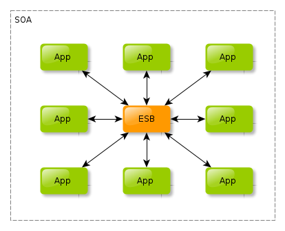

# Documentación de código
Un ESB es una implementación de una orquestación de servicios, comunicando cada uno de estos. Provee abstracción a los clientes, quienes conocen el ESB, aunque desconocen su  implementación interna. 

Basados en esta descripción, un ESB se puede asemejar a una aplicación con el Patrón de Diseño Comando. Este patrón encapsula una solicitud para realizar una acción, como un objeto, lo que permite parametrizar otros objetos con diferentes solicitudes. 

En esta tarea, nos pide realizar un simulador de un ESB. Por facilidad, toda la apliación se maneja desde la consola; y todas las variables utilizadas serán configuradas desde el inicio, en el método Main.

## Main
En esta clase se configuran 2 arreglos:
1. Arreglo de usuarios
2. Arreglo de clientes

Estos son pasados a un objeto comando, que simula ser un ESB. Luego se ejecutan las acciones del ESB. Estas acciones se ven en esb.esb_simulator.

## ESB
### esb_simulator
En esta clase se controlan las acciones que se simularán
1. Un cliente pide un Uber
2. El sistema recibe la petición y busca el primer carro disponible
    1. Si ningun carro está disponible, se termina la búsqueda para este cliente
3. Se encuentra carro disponible, por lo que se procede a avisar al piloto de la disponibilidad de un viaje
4. El piloto "llegará" con el cliente e iniciaran el servicio, simulando el rastreo del carro
5. Al pasar el tiempo, el piloto arriba al destino, terminando su servicio    
6. El cliente concluye su viaje

### service_car
En esta clase se simulan todos los estados del piloto
- Solicitud recibida
- Estado del carro
- Aviso al piloto
- Rastreo del viaje    
- Llegada a destino

### service_client
En esta clase se simulan todas las acciones del cliente
- Petición de servicio
- Finalización de servicio